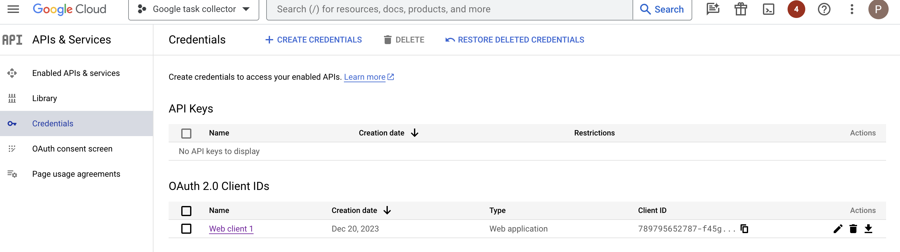
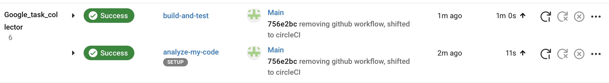
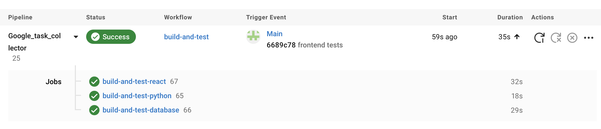

# Google Tasks Collector

## Purpose
Google Tasks Collector is a web application designed to consolidate and manage tasks from various Google Suite sources. It provides a unified interface for users to access and interact with their tasks across different Google services.

## Features
- **Task Retrieval**: Fetch tasks from Google Suite services and display them in a unified format.
- **User-Friendly Interface**: Easy-to-use frontend for interacting with tasks.
- **Secure Authentication**: OAuth integration for secure access to Google Services.

## Installation and Usage

### Requirements
- Python 3.6 or higher
- Flask
- SQLite
- React
- Node.js and npm
- [Google Cloud](#google-cloud)

### Google Cloud
To run the backend code, you need to generate a key for OAuth 2.0 credentials.

After registering for a Google Cloud account, do the following: 
- Create a new project 
- Go to APIs & Services, and click Enable APIs and Services
- Search for "Google Tasks API"
- Click to enable
- Navigate to the APIs & Services page, accessible from the side menu
- On the Credentials tab, click Create Credentials > OAuth Client ID
- This is a web application.
- For more information, see [how to authorize credentials for a web application on GCP](https://developers.google.com/tasks/quickstart/js#authorize_credentials_for_a_web_application).



Download this key as a `.json` file (the action on the far right), then place this file in the [Backend](./Backend/) directory. 

Modify the value of `CLIENT_SECRET_FILE` at the beginning of `Backend/tasks.py` to the name of your credential key file, as shown here:

```python
CLIENT_SECRET_FILE = './your-credential-key.json'
API_NAME = 'tasks'
API_VERSION = 'v1'
...
```

After this, you should be ready to set up the backend and database.

### Backend and Database Setup

> [!NOTE]
> A SQLite database is used. It is automatically set up when running the backend.

1. In the root directory, install the required Python packages: `pip install -r requirements.txt`
2. Navigate to the [backend](./Backend/) directory.
3. Run the Flask application: `python app.py`

### Frontend Setup
1. Navigate to the [frontend](./tasks-frontend/) directory.
2. Install the necessary npm packages: `npm install`
3. Start the React application: `npm start`

The app should run at `localhost:5000`.

## Contribution Guidelines
- **Code Reviews**: All contributions are to be reviewed via pull requests.
- **Style Guide**: Follow the existing coding style for consistency.
- **Testing**: Write tests for new features and ensure existing tests pass.
- **Documentation**: Update documentation and comments as necessary.

## Running the Project
- Ensure the backend server is running before starting the frontend.
- Access the application via the browser at the specified localhost port.

## Testing with CircleCI




